<h1 align="center">Return to the Jungle</h1>

ℹ️ Repositorio para el desarrollo de un videojuego en C++ para la asignatura "Software de Entretenimiento y Videojuegos"
 

  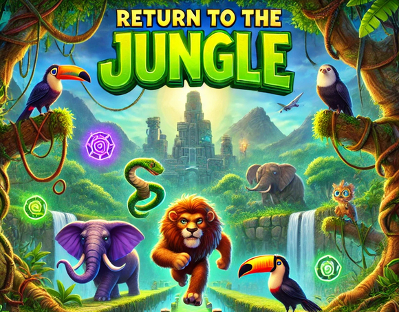

## Vídeo

https://github.com/user-attachments/assets/bcb6f4cd-9636-449c-8ff1-1d6ba8606789

## Concepto

El concepto del juego es un plataformas en 2D donde los protagonistas son 5 animales

El objetivo de estos animales es pasar a través de la ciudad para poder volver a la jungla. Para conseguirlo, deberán lidiar con obstáculos y enemigos

## Personajes

Cada uno de nuestros personajes dispone de una habilidad única que le permitirá completar el nivel o obtener ciertos coleccionables

| Personaje | Habilidad                                                            | Sprite                                                                                      |
| ---       | ---                                                                  | ---                                                                                         |
| Mono      | Trepar por lianas                                                    | 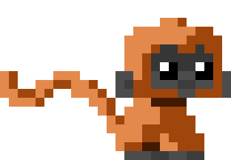           |
| Elefante  | Destrozar cajas con su trompa                                        | 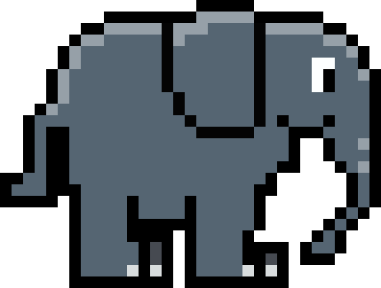   |
| Serpiente | Reptar por huecos por los que el resto de personajes no podrán pasar | 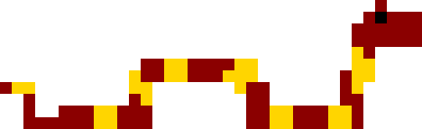 |
| Tucán     | Doble salto                                                          | 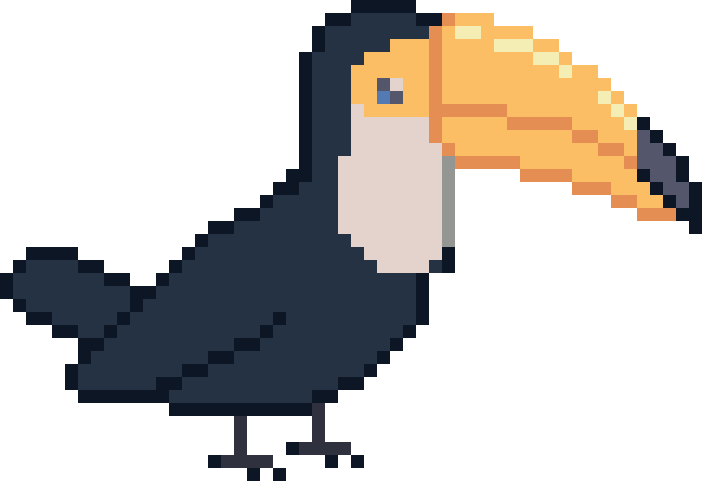         |
| Capibara  | Capacidad para nadar                                                 | 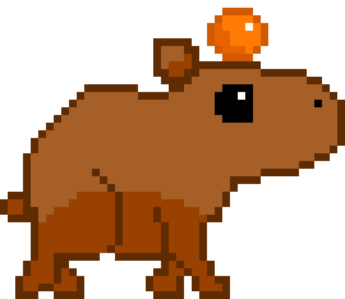   |

Cada personaje, además de sus habilidades únicas, dispone de características diferentes en cuanto a velocidad y capacidad de salto

Cada nivel tendrá un personaje prefijado (necesario para poder completar dicho nivel) y requerirá de dos personajes más que elegirá el jugador. Su elección condicionará la posibilidad de conseguir o no todos los coleccionables del nivel

## Sprites

Todos los sprites de personajes y enemigos han sido desarrollados a mano utilizando herramientas como Piskel

## Niveles

Los niveles se han desarrollado siguiendo un diseño basado en tiles que se representan como caracteres en ficheros de texto

## Controles

| Teclas                                                                                                                         | Función                             |
| ---                                                                                                                            | ---                                 | 
| 
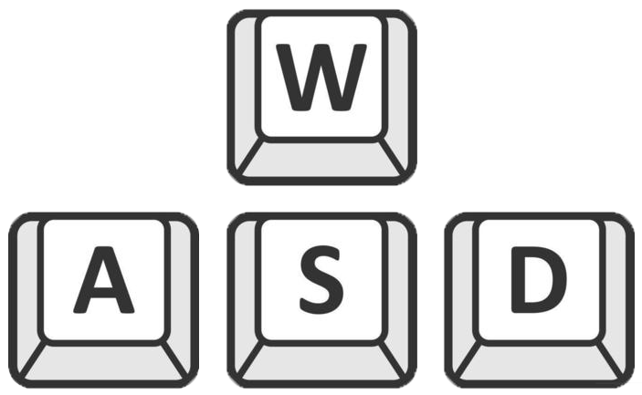
             | Desplazarse y saltar                | 
| 

         | Cambiar de personaje                | 
| 

              | Redimensionar la pantalla del juego | 
| 
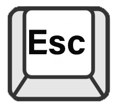
                        | Salir del juego                     |
| 
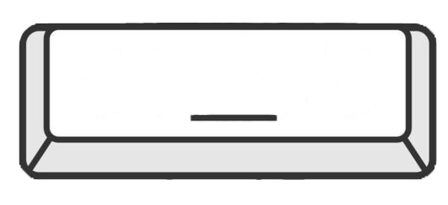
 | Romper cajas con el elefante        |

## Como Utilizar

El videojuego ha sido desarrollado enteramente en C++ y se ha utilizado la librería de gráficos **SDL2 - Simple DirectMedia Layer**.

Para poder iniciar el juego se requiere que las librerías se ubiquen en una carpeta C:/videojuegos de la siguiente manera:

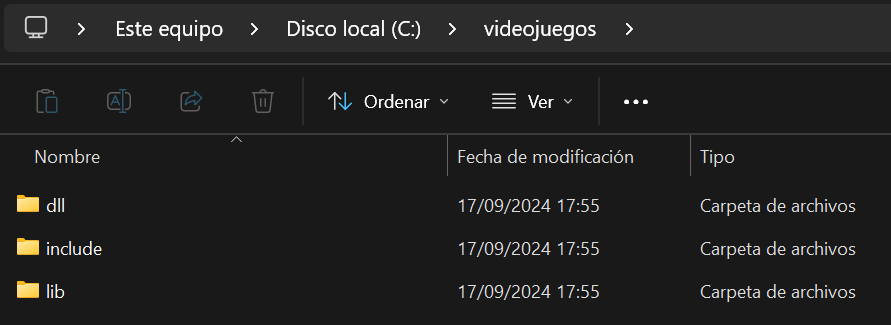

El juego se inicia en Visual Studio de Microsoft configurando su inicio en `x86`

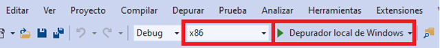
